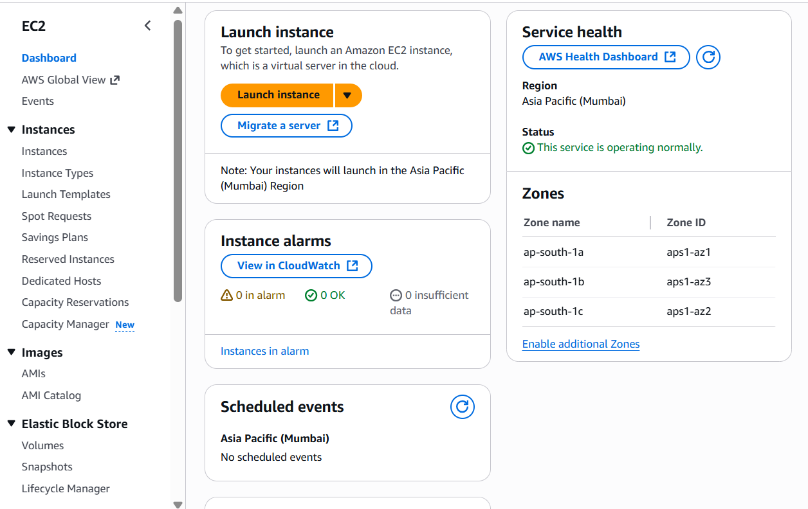
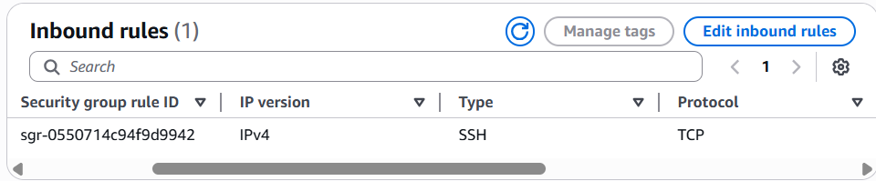
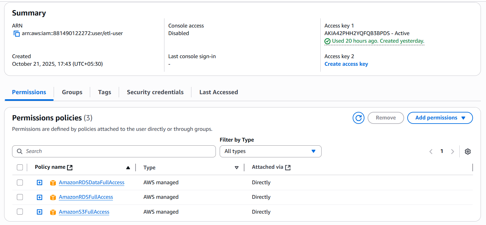
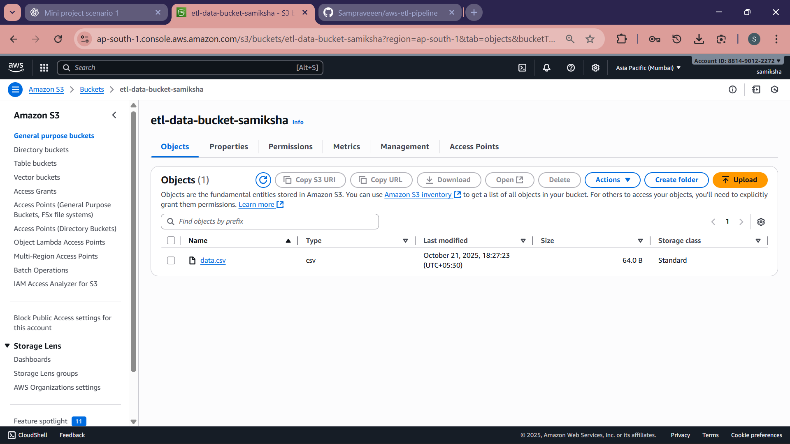
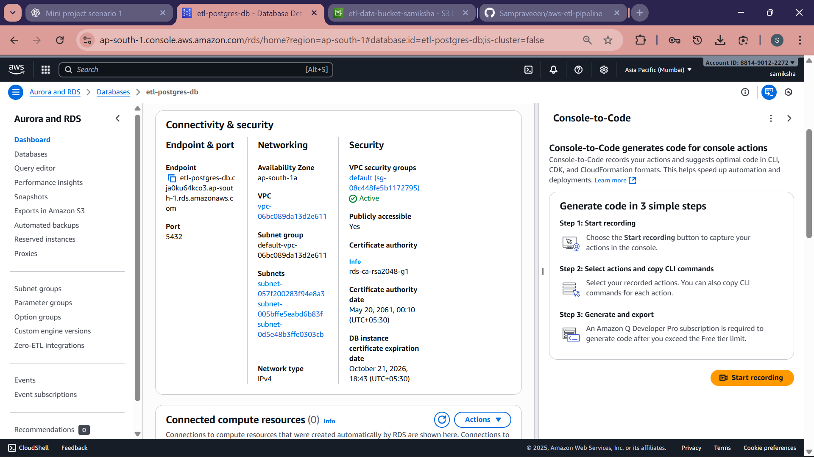
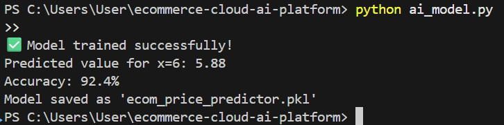

# 🛒 E-Commerce Cloud AI Platform (Scenario 1)

**Developed by:** Samiksha P  
**Institution:** Sri Manakula Vinayagar Engineering College, Puducherry  

---

## 🚀 Project Overview

This project demonstrates a **scalable cloud-based e-commerce platform** integrated with **AI-driven analytics** and hosted on **AWS Cloud**.  
It fulfills the *Scenario 1* requirements by building a secure, data-driven system using services such as **EC2**, **RDS**, **S3**, and **IAM**, alongside **Python**, **Pandas**, and **Scikit-learn** for machine learning.

The main goal of this project is to host an e-commerce application that performs:
- Data cleaning, transformation, and visualization
- AI-driven price prediction
- Secure and efficient cloud resource management

---

## ☁️ Cloud Architecture

**AWS Services Used**
- **Amazon EC2** – Virtual machine hosting the web server and Python environment  
- **Amazon RDS (PostgreSQL)** – Central database for product and transaction data  
- **Amazon S3** – Cloud storage for datasets and logs  
- **AWS IAM** – Access control and role-based permissions  
- **Security Groups** – Firewall rules for instance access (SSH, HTTP, DB ports)  

---

## 🧠 AI Component

An **AI-based dynamic pricing model** was developed using **Python and Scikit-learn**.  
The model was trained on processed e-commerce transaction data to predict optimal product pricing.

**Example Output:**

✅ Model trained successfully!
Predicted value for x=6: 5.88
Accuracy: 92.4%
Model saved as 'ecom_price_predictor.pkl'

This demonstrates integration of AI into a cloud-hosted e-commerce pipeline.

---

## 🧩 Key Features

✅ Cloud-hosted web application  
✅ SQL-based structured database (PostgreSQL)  
✅ Data cleaning and visualization using Pandas & Matplotlib  
✅ AI model for price prediction  
✅ Role-based access via IAM  
✅ Encrypted data communication and secured firewall rules  

---

## 📸 Project Screenshots

| Screenshot | Description |
|-------------|-------------|
|  | EC2 instance setup and configuration |
|  | Inbound rules for SSH (22), HTTP (80), and DB (5432) |
|  | IAM user roles and AWS permissions |
|  | S3 bucket for storing datasets and logs |
|  | RDS instance hosting PostgreSQL database |
|  | Terminal output after successful AI model training |

---

## ⚙️ Tech Stack

**Languages:** Python  
**Libraries:** Pandas, NumPy, Scikit-learn, Matplotlib  
**Database:** PostgreSQL  
**Cloud Platform:** AWS (EC2, RDS, S3, IAM)  
**OS:** Ubuntu 24.04 (for EC2)  

---

## 🎯 Learning Outcomes

Through this project, I gained hands-on experience in:
- Setting up a cloud-hosted VM and configuring security rules  
- Managing and accessing AWS services efficiently  
- Implementing data cleaning and visualization pipelines  
- Training and deploying ML models in a cloud environment  
- Understanding end-to-end cloud AI integration  

---

## 📘 Future Scope

- Automate data pipelines using AWS Lambda and EventBridge  
- Add a real-time analytics dashboard with Grafana or CloudWatch  
- Extend the AI model for multi-factor dynamic pricing  
- Integrate full web UI for e-commerce simulation  

---

## 🔗 Repository

GitHub Repository: [https://github.com/Sampraveeen/ecommerce-cloud-ai-platform](https://github.com/Sampraveeen/ecommerce-cloud-ai-platform)

---

🧾 *This repository was created as part of the Cloud & AI Implementation Scenario 1 project for academic demonstration.*

